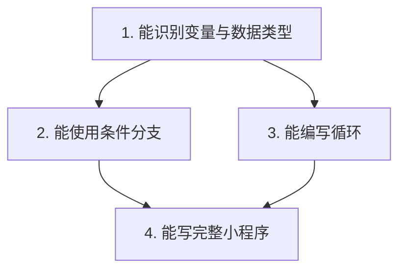

# 产出文档模板（Deliverable Templates）

> 教学过程中产出的四类文档统一使用本文件的结构。模板是默认规范，
> 学科特性需要时可增减小节，但核心要素（目标、证据、易错点、下一步）不得省略。

## 目录

1. [学习计划与知识图谱](#1-学习计划与知识图谱)
2. [知识笔记 / 讲义](#2-知识笔记--讲义)
3. [练习与阶段测验](#3-练习与阶段测验)
4. [掌握度评估报告与复习计划](#4-掌握度评估报告与复习计划)

---

## 1. 学习计划与知识图谱

档案初始化时 `00-学习计划.md` 已有骨架，备课时按以下要求填好：

**知识点拆解标准**

- 粒度：每个知识点 = 一次可走完"讲解→提问→练习→小结"的小块（约 10~30 分钟对话量）。
- 命名：用"能做什么"命名，优先动宾结构，如"能用代入法解二元一次方程组"，而不是"二元一次方程组"。
- 每个知识点标注：先修关系、重要度（高/中/低）、是否要求 L4。

**知识图谱（mermaid 示例）**



**备课输出检查清单**

- [ ] 学习目标改写为可检验的行为（"学完能独立完成 X，正确率达到 Y"）
- [ ] 知识点覆盖目标所需全部内容，且按先修关系排序
- [ ] 每个里程碑对应一次测验，测验范围与知识点映射清楚
- [ ] 计划已向学生展示并确认（或根据学生时间预算调整过）

## 2. 知识笔记 / 讲义

保存为 `notes/NN-知识点名.md`，在该知识块教学结束后产出（内容应吸收教学中暴露的误区，不是课前教案的复制）。

```markdown
# NN 知识点名

> 所属：学习计划第 N 块 ｜ 先修：… ｜ 难度：★★☆

## 一句话概括
（学完后最该记住的一句话）

## 它是什么 / 为什么需要它
（从课堂上的具体例子或问题引入，说明解决什么痛点）

## 核心讲解
- 定义/规则：
- 直观解释或类比：
- 关键步骤（技能类写成编号步骤）：
  1.
  2.
  3.

## 例子
**正例**：
**反例 / 易混对比**：

## 易错点（来自本次学习的真实问答）
1. …… → 正确理解：……

## 自测问题
（不看答案能回答即达到 L2）
1.
2.

## 关联知识
- 先修：[[上一知识点]]
- 后续：[[下一知识点]]
```

要求：用学生能听懂的话写；保留课堂上有效的类比和学生踩过的坑；不要堆砌教材原文。

## 3. 练习与阶段测验

### 3.1 随堂练习 `exercises/NN-知识点-练习.md`

```markdown
# 练习：知识点名（第 N 块）

- 对应知识点：…
- 层级：A 再认/模仿 ｜ B 独立应用 ｜ C 变式/综合
- 要求：闭卷独立完成，做完再对答案

## A 组（基础）
1. 题目
2. 题目

## B 组（应用）
3. 题目

## C 组（挑战，选做）
4. 题目

---

## 参考答案与解析（练习阶段不要提前看）

1. **答案**：…
   **思路**：…
   **易错点**：…
```

### 3.2 阶段测验 `exercises/阶段测验M1-范围.md`

- 组卷前先写**考查双向表**：每行一个知识点，对应题号与层级，保证覆盖该里程碑所有"高重要度"知识点且重点知识占主要分值。
- 题量按约定时长配置（经验值：每分钟约 1 个客观题分值；主观题预留书写时间），默认满分 100。
- 结构：测验说明（范围、时长、闭卷要求、计分方式）→ 题目（按层级排序）→ 参考答案与评分标准 → 考查点映射表。

```markdown
# 阶段测验 M1：范围（如 知识点 1~5）

- 时长：xx 分钟 ｜ 满分：100 ｜ 闭卷独立完成
- 达标线：80 分；重点知识点（第 2、4 块）对应题目不允许整题失分

## 一、选择题（每题 x 分）
1. ……

## 二、应用题
……

---

## 参考答案与评分标准
| 题号 | 答案/要点 | 评分标准 | 考查知识点 |
|---|---|---|---|
| 1 | … | … | K1 |

## 测验后分析（批改后填写）
- 总分： ｜ 达标：是/否
- 失分知识点分布：
- 需降级/重学的知识点：
- 进入下一里程碑 / 补救安排：
```

出题纪律：题目必须围绕教学内容与目标，不考偏题怪题；答案与解析在出题时一并写好；学生作答前不展示答案区。

## 4. 掌握度评估报告与复习计划

### 4.1 阶段评估 / 结课报告 `reports/阶段评估-Mx-YYYY-MM-DD.md` 或 `reports/结课报告-YYYY-MM-DD.md`

报告必须基于台账真实证据撰写，结论可追溯到具体问答与练习。

```markdown
# 阶段评估报告 Mx：主题（YYYY-MM-DD）

## 一、总体结论
- 覆盖范围：知识点 1~N
- 进度：x / N 达到 L3 及以上（xx%）
- 测验成绩：xx 分（如已测验）
- 一句话评价：

## 二、掌握度明细
| 知识点 | 等级 | 证据（问答/练习） | 评价 |
|---|---|---|---|
| K1 | L3 | 练习 ex01 全对；能解释… | 已达标 |
| K2 | L2 | 概念提问正确，应用题错 1 道 | 需补练 |

## 三、薄弱点与错因分析
1. **知识点**：表现…，根因（概念/方法/审题/熟练）…，补救动作…
2. ……

## 四、已产出文档
- 讲义：notes/…
- 练习与测验：exercises/…

## 五、下一步安排
- 需重学/补练：…
- 下一里程碑：…
- 复习任务（同步写入复习计划）：…
```

结课报告额外包含：目标达成度对照（逐条回答开课时目标是否达成）、整体知识图谱掌握情况、长期复习日程、后续自学建议（延伸主题与资源类型；不编造具体链接）。

### 4.2 复习计划 `reports/复习计划-YYYY-MM-DD.md`

```markdown
# 复习计划：主题（自 YYYY-MM-DD 起）

> 间隔重复节奏：+1 天 → +3 天 → +7 天 → +14 天 → +30 天；
> 每次复习用主动回忆（提问/小测），不看笔记；答错则降级并从 +1 天重新起算。

| 复习内容 | 形式 | 计划日期 | 实际完成 | 结果 |
|---|---|---|---|---|
| K1 + K2 | 3 道快问快答 | 日期 | | |
| K3 | 重做错题本 #1 | 日期 | | |
| 综合 | 一套混合小测 | 日期 | | |
```

日期要算出具体日历日期写入表格（可借助日期计算工具），不要只写"+3 天"让学生自己算。
